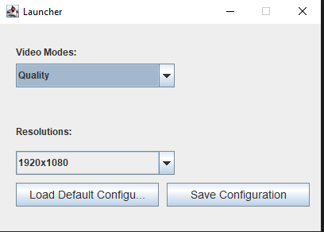

# Universal-Game-Launcher
Universal Crossplatform Game Launcher
<br>
<p>doomgames 2025# targetting legacy hardware and yo shiz</p>
<br>
</img>
<br>
<p>java 11+</p>
<p>targetting DG2D .INI wrapper</p>
<br>

## how to implement?

(ini format explained)

```performancemode``` - 0 (quality) , 1 (performance) <br>
```windowresolution``` - more info later related to the resolution alg

the ini format is based of DG2D INI wrapper <a href="https://github.com/shadow9owo/DG2D/tree/main/ini">link</a>

<br>

### how is the window resolution list generated?

(java)
````
        GraphicsDevice gd = GraphicsEnvironment.getLocalGraphicsEnvironment().getDefaultScreenDevice();
        DisplayMode[] modes = gd.getDisplayModes();
        Set<String> resolutionSet = new HashSet<>();

        for (DisplayMode mode : modes) {
            resolutionSet.add(mode.getWidth() + "x" + mode.getHeight());
        }

        List<String> resolutionList = new ArrayList<>(resolutionSet);

        resolutionList.sort((a, b) -> {
            String[] partsA = a.split("x");
            String[] partsB = b.split("x");
            int pixelsA = Integer.parseInt(partsA[0]) * Integer.parseInt(partsA[1]);
            int pixelsB = Integer.parseInt(partsB[0]) * Integer.parseInt(partsB[1]);
            return Integer.compare(pixelsB, pixelsA); // descending
        });
````
example implementation in C && RAYLIB
````
//libs
#include "raylib.h"
#include <stdio.h>
#include <stdlib.h>

//struct
typedef struct {
    int width;
    int height;
} Resolution;

//sort
int compareResolutions(const void *a, const void *b) {
    Resolution *ra = (Resolution *)a;
    Resolution *rb = (Resolution *)b;
    int pixelsA = ra->width * ra->height;
    int pixelsB = rb->width * rb->height;
    return pixelsB - pixelsA; // descending
}

// main
int monitorCount = GetMonitorCount();
Resolution *resolutions = malloc(monitorCount * sizeof(Resolution));

for (int i = 0; i < monitorCount; i++) {
    resolutions[i].width = GetMonitorWidth(i);
    resolutions[i].height = GetMonitorHeight(i);
}

qsort(resolutions, monitorCount, sizeof(Resolution), compareResolutions);

for (int i = 0; i < monitorCount; i++) {
     printf("Monitor %d: %dx%d\n", i, resolutions[i].width, resolutions[i].height);
}

````

dg2d shadowdev - 2025
